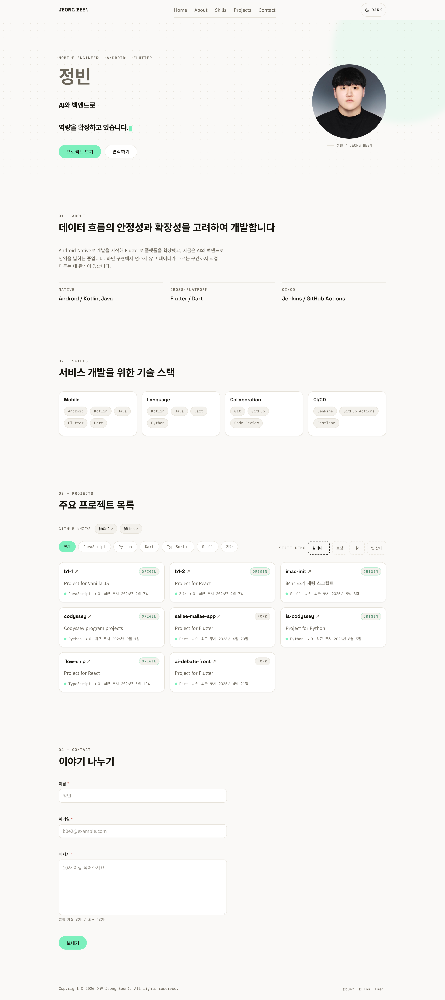
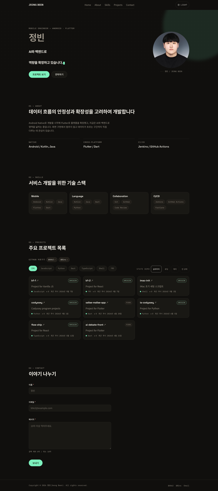
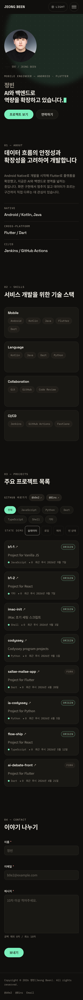

# 나를 소개하는 웹페이지

외부 라이브러리 없이 순수 HTML, CSS, JavaScript만으로 만든 반응형 포트폴리오입니다.
프레임워크 없이 **사용자 이벤트 → 상태 변경 → 화면 업데이트** 흐름을 직접 구현하는 것을 목표로 합니다.

- 배포 URL: https://b0e2.github.io/b1-1/
- 저장소: https://github.com/b0e2/b1-1

> 위 URL은 `main` 브랜치가 서비스됩니다. 아래 스크린샷과 이 문서의 설명은 **최종 구현 기준**이며,
> `develop`을 `main`으로 릴리스하기 전까지 공개 URL에는 이전 화면이 표시됩니다.
> 최종 화면의 실제 접속 확인은 릴리스 이후 단계에서 수행합니다.

## 사용 기술

| 구분 | 내용 |
| --- | --- |
| 마크업 | HTML5 시맨틱 태그 |
| 스타일 | CSS 변수, Flexbox, Grid, 모바일 퍼스트 반응형 |
| 스크립트 | ES Modules, DOM API, Fetch API |
| 폰트 | Google Fonts (Space Grotesk, Noto Sans KR, IBM Plex Mono) |
| 배포 | GitHub Pages |

React, Vue, jQuery, Bootstrap, Tailwind 등 외부 UI/JS 라이브러리는 사용하지 않았습니다.

## 폴더 구조

```
.
├── index.html
├── css/
│   ├── style.css        # 진입점. 아래 파일들을 순서대로 import
│   ├── tokens.css       # 색상·타이포·간격·그림자 토큰 (라이트/다크)
│   ├── base.css         # reset, 요소 기본값, 접근성 보조
│   ├── layout.css       # 컨테이너·헤더·섹션·그리드 골격, 반응형
│   ├── components.css   # 여러 섹션이 함께 쓰는 버튼·칩·카드·헤더·top 버튼
│   ├── sections.css     # Hero·About·Skills·Footer의 표현
│   ├── projects.css     # 프로젝트 카드·언어 필터·상태 화면
│   └── contact.css      # 문의 폼 입력·오류·글자 수·성공 패널
├── js/
│   ├── main.js          # 조립 지점. 기능 초기화와 렌더 구독만 한다
│   ├── store.js         # 전역 상태와 구독
│   ├── dom.js           # DOM 헬퍼
│   ├── github-api.js    # 저장소 요청·오류·정규화와 응답 캐시
│   └── features/        # 기능별 모듈 (상태·이벤트·렌더를 함께 소유)
│       ├── theme.js         # 다크 모드
│       ├── navigation.js    # 메뉴·앵커·스크롤 임계값·맨 위로
│       ├── scroll-reveal.js # 등장 효과
│       ├── typing.js        # Hero 타이핑 효과
│       ├── projects.js      # 프로젝트 목록과 상태별 화면
│       └── contact-form.js  # 문의 폼 검증과 성공 패널 전환
├── images/
│   └── profile.jpg      # Hero 프로필 사진
└── .github/screenshots/ # README 전용 캡처
    ├── desktop-light.png
    ├── desktop-dark.png
    └── mobile-dark.png
```

HTML이 직접 연결하는 파일은 `index.html` · `css/style.css` · `js/main.js` 셋뿐이고, 나머지는 `@import`와
`import`로 들어옵니다. CSS는 JavaScript를 기능 단위로 나눈 것과 같은 축으로 나눕니다.
`projects.css`는 `features/projects.js`와, `contact.css`는 `features/contact-form.js`와 짝을 이룹니다.
여러 섹션이 재사용하는 표현만 `components.css`에 남기고, 정적 섹션의 표현은 `sections.css`가 맡습니다.

## 실행 방법

ES Modules는 `file://`에서 CORS 정책 때문에 로드되지 않습니다.
**반드시 로컬 HTTP 서버로 열어야 합니다.**

저장소 루트에서 아래 중 하나를 씁니다.

```bash
python3 -m http.server 8000
# http://127.0.0.1:8000 접속
```

또는 VS Code에서 Live Server 확장을 설치하고 `index.html`에서 우클릭 → **Open with Live Server**를 고르면
`http://127.0.0.1:5500` 형태의 주소로 열립니다.

빌드 단계는 없습니다. 정적 파일을 그대로 서빙하면 됩니다.

## 배포

GitHub Pages의 **branch 방식**으로 배포합니다. 빌드 산출물이 없는 정적 사이트라 별도 워크플로가 필요 없습니다.

1. 저장소 **Settings → Pages**로 들어갑니다.
2. **Source**를 `Deploy from a branch`로 둡니다.
3. **Branch**를 `main`, 폴더를 `/ (root)`로 고르고 저장합니다.
4. 잠시 뒤 같은 화면에 공개 URL이 표시되면 https://b0e2.github.io/b1-1/ 로 접속해 확인합니다.

공개되는 것은 `main` 브랜치의 내용입니다. 따라서 `develop`에 반영한 최종 화면은
`develop → main` 릴리스를 마친 뒤에야 공개 URL에 나타납니다. 릴리스 후에는 강력 새로고침으로
캐시를 비우고, 테마 전환·모바일 메뉴·Projects 4상태·문의 폼 네 시나리오를 공개 URL에서 한 번 더 확인합니다.

## 스크린샷

최종 구현을 로컬에서 실행해 촬영했습니다. 세 장 모두 페이지 전체를 담았고, 등장 효과가 모두 끝난 상태입니다.

### 데스크톱 · 라이트 (1280px)



### 데스크톱 · 다크 (1280px)



### 모바일 · 다크 (375px)



> Projects 카드의 언어 라벨과 최근 푸시일은 **촬영 시점의 GitHub 응답** 기준입니다.
> 저장소가 갱신되면 지금 화면과 달라질 수 있습니다.

## 동작 기준값

| 항목 | 값 |
| --- | --- |
| 헤더 배경 전환 | `scrollY >= 60px` |
| 맨 위로 버튼 노출 | `scrollY > 320px` |
| 앵커 이동 보정 | `scroll-padding-top: 72px` (헤더 실제 높이 64px) |
| 스크롤 등장 효과 | `IntersectionObserver` threshold `0.2` |
| Hero 타이핑 | 입력 `70ms` · 삭제 `34ms` · 완성 후 대기 `1.6s`, 문구 3개 반복 |
| Hero 커서 blink | `1s` 주기 |
| 브레이크포인트 | `768px`(모바일↔태블릿), `1024px`(데스크톱), `1180px`(Hero 대형 타이포) |

헤더 전환과 맨 위로 버튼은 각각 다른 상수를 씁니다. 하나의 스크롤 값으로 두 동작을 묶으면
한쪽 기준을 바꿀 때 다른 쪽이 조용히 따라 움직입니다.

테마는 저장값을 먼저 복원하고, 저장값이 없을 때만 `prefers-color-scheme`을 초기값으로 씁니다.
모바일 메뉴는 링크 클릭·768px 이상 전환·Escape 세 경로로 닫힙니다.

### 프로필 사진을 Hero에 둔 이유

확정 디자인의 Hero는 왼쪽에 이름과 문구, 오른쪽에 원형 프로필 사진이 서는 2열입니다. 처음에는 사진을
About으로 내렸는데, 그러면 Hero 아래쪽이 크게 비고 디자인과 인상이 달라집니다. 그래서 사진과 캡션은
Hero로 옮기고 About에는 자기소개와 지표를 남겼습니다.

미션은 About에 자기소개와 프로필 이미지를 요구합니다. 이 구성에서 프로필 이미지는 Hero에 있지만, Hero와
About은 사이에 다른 내용 없이 이어지는 한 덩어리의 도입부이고 사진의 캡션이 About의 자기소개를 그대로
받습니다. 화면에서 About은 `01 — About` 라벨과 제목을 가진 독립 섹션으로 계속 식별되며, 내비게이션의
About 링크도 그 위치로 이동합니다.

타이핑 문구의 자리는 `height`로 못 박았습니다. 스타일시트 일곱 장이 서로 다른 시점에 적용되기 때문에 첫
페인트에 잠깐 글자 크기와 칸 너비가 어긋난 중간 상태가 생기는데, `min-height`로는 그때 문구가 세 줄이 되는
것을 막지 못해 CTA가 아래로 밀립니다. 높이를 고정하면 그 순간을 지나가면서도 버튼 위치가 흔들리지 않습니다.

## 설계 Q&A

### 1. 시맨틱 태그는 어떤 기준으로 골랐나요

**그 자리에 무엇이 있는지가 태그 이름으로 남는지**를 기준으로 골랐습니다. `div`는 그 기준을 만족하는 태그가 없을 때만 쓰는 마지막 선택입니다. 그래서 페이지 뼈대는 `header` · `nav` · `main` · `footer`를 각각 하나씩만 두어 랜드마크가 겹치지 않게 했고, 다섯 개 `section`은 모두 `aria-labelledby`로 자기 제목과 연결해 이름 없는 구획이 남지 않게 했습니다.

내용의 성격에 맞는 태그도 함께 봤습니다. Skills 카드와 Projects 카드는 목록에서 떼어 내도 그 자체로 말이 되므로 `article`이고, 프로필 사진과 캡션은 `figure` + `figcaption`, About의 지표 세 개는 "용어와 값" 쌍이라 `dl` · `dt` · `dd`, 카드의 최근 푸시일은 기계가 읽을 값을 함께 담을 수 있는 `<time datetime="...">`입니다.

이렇게 하면 스크린 리더 사용자가 랜드마크와 제목만으로 페이지를 훑을 수 있고, `h1`은 Hero에 하나만 두어 제목 단계가 건너뛰지 않습니다. 반대로 전부 `div`로 만들면 같은 화면을 만들기 위해 `role`과 `aria-*`를 손으로 붙여야 하는데, 그것은 이미 태그가 공짜로 주는 정보를 다시 적는 일입니다.

### 2. CSS 변수를 쓰면 무엇이 좋나요

`tokens.css`에 값을 한 번만 정의하고, 나머지 파일은 `--color-surface`, `--space-3`처럼 **역할 이름**으로만 참조합니다. 덕분에 테마 전환이 `theme.js`의 `document.documentElement.dataset.theme = theme` **한 줄**로 끝납니다. `[data-theme="dark"]` 블록이 같은 이름의 변수를 다시 정의하면 그 변수를 쓰는 모든 규칙이 한 번에 따라오고, JavaScript는 색 규칙을 하나도 알지 못합니다.

값이 아니라 역할로 부르기 때문에 재사용도 자연스럽습니다. `--color-danger-bg`와 `--color-danger-border`는 문의 폼의 오류 입력과 Projects의 `error` 화면이 함께 쓰고, 두 곳의 "위험" 표현이 저절로 같아집니다. 간격도 `--space-1`부터 `--space-7`까지 스케일로 묶어 두어 어중간한 수치가 끼어들지 않습니다.

미디어 쿼리에서 **변수 자체를 갈아 끼울 수 있다**는 점도 큽니다. `--text-hero`는 768px과 1180px에서, `--container-pad`는 1024px에서 값만 바뀌고, 그 변수를 쓰는 규칙은 그대로 둡니다. 브레이크포인트마다 같은 선택자를 다시 쓰지 않아도 됩니다.

### 3. Flexbox와 Grid는 어떤 근거로 나눠 썼나요

기준은 **축이 하나인가 둘인가**입니다. 한 축으로 흐르고 항목 크기가 내용에 따라 정해지면 Flexbox, 행과 열이 함께 필요하거나 화면 폭에 따라 열 수가 바뀌어야 하면 Grid를 씁니다.

Flexbox는 헤더의 `.nav`(로고 · 메뉴 · 액션을 한 줄에 놓고 남는 공간을 밀어냄), `.projects__toolbar`(언어 칩 묶음과 STATE DEMO를 양 끝으로), 칩과 배지가 늘어서는 행들이 맡습니다. 항목이 넘칠 때는 `flex-wrap`으로 다음 줄에 흘려보내면 되므로 규칙이 더 필요하지 않습니다.

Grid는 개수를 미리 알 수 없거나 2차원 배치가 필요한 곳입니다. `.projects__grid`는 `repeat(auto-fit, minmax(min(18.75rem, 100%), 1fr))` 하나로 미디어 쿼리 없이 열 수가 스스로 정해집니다. 카드 개수가 GitHub 응답에 따라 달라지기 때문입니다. `min(18.75rem, 100%)`로 감싼 이유는 320px처럼 좁은 화면에서 최소 폭이 컨테이너를 넘어 가로 스크롤이 생기는 것을 막기 위해서입니다. `.hero__inner`는 768px에서 `minmax(0, 1fr) auto` 2열이 되어 사진은 자기 지름만 차지하고 남는 폭을 전부 제목이 가져갑니다. `fr` 비율로 나누면 화면이 좁아질 때 제목 칸이 먼저 줄어 타이핑 문구가 예약한 두 줄을 넘기기 때문입니다. `.skills__grid`는 768px에서 2열, 1024px에서 4열로 바뀝니다. 간격은 두 방식 모두 `margin`이 아니라 `gap`으로만 줍니다.

### 4. addEventListener와 onclick은 무엇이 다른가요

`onclick`은 요소당 핸들러를 **하나만** 가질 수 있어 나중에 붙인 것이 앞의 것을 조용히 덮어씁니다. `addEventListener`는 같은 이벤트에 여러 핸들러를 붙일 수 있고 `removeEventListener`로 떼어낼 수도 있습니다. 또 `onclick`은 동작을 HTML 속성에 적게 만들어 구조와 로직이 한 파일에 섞입니다. 이 저장소의 `index.html`에는 인라인 이벤트 속성이 하나도 없고, 모든 연결은 각 기능의 `init<Feature>()` 안에서만 일어납니다.

**이벤트 위임**이 필요한 곳에서는 차이가 더 분명합니다. 언어 필터 칩, STATE DEMO 버튼, `다시 시도`와 `필터 초기화` 버튼은 상태가 바뀔 때마다 새로 그려지거나 응답에 따라 개수가 달라집니다. `addEventListener`로 부모 컨테이너에 **한 번만** 걸어 두면 안쪽이 몇 번 바뀌어도 그대로 동작하지만, `onclick`이라면 요소를 만들 때마다 매번 다시 붙여 줘야 합니다.

옵션을 줄 수 있다는 점도 실제로 씁니다. 스크롤 핸들러는 `{ passive: true }`로 등록해 브라우저가 스크롤을 기다리지 않게 했습니다. 그리고 이 프로젝트가 다루는 이벤트에는 `matchMedia`의 `change`, `document`의 `visibilitychange`와 `keydown`, 입력의 `blur`처럼 애초에 `on*` 속성으로는 다룰 수 없거나 마크업에 적을 수 없는 것들이 섞여 있어, 연결 방식을 하나로 통일하는 편이 읽기 쉽습니다.

### 5. STATE 객체를 따로 둔 이유는 무엇인가요

`let isDark = false`처럼 기능마다 전역 변수를 두면 값이 몇 개인지도 모르게 늘어나고 서로 어긋나기 시작합니다. 더 나쁜 쪽은 상태를 아예 두지 않고 `classList.contains('dark')`처럼 **DOM에서 되읽는 것**입니다. 그러면 화면이 곧 상태가 되어, 화면을 고치는 순간 상태가 망가집니다. `store.js`의 객체 하나에 모아 두면 현재 값과 그것을 바꾸는 지점, 화면이 갱신되는 이유를 한곳에서 볼 수 있고, `setState`가 기존 객체를 고치지 않고 새 객체로 교체하므로 변경 전후를 비교할 수 있습니다.

다만 **모든 값을 넣지는 않았습니다.** 기준은 "저장하거나, 다른 기능과 공유하거나, 다시 그려야 하는 값인가"입니다. `scroll-reveal`과 `typing`은 셋 다 아닙니다. 한 번 보이고 끝나는 일시적인 효과라 저장할 이유가 없고, 특히 타이핑을 상태에 넣으면 글자 하나마다 `setState`가 돌아 70ms마다 전체 렌더가 반복됩니다. 그래서 이 둘만 자기 타이머와 진행 위치를 직접 들고 있습니다.

반대로 **일부러 필드를 나눈 경우**도 있습니다. Projects의 STATE DEMO 선택값은 `status`를 덮어쓰지 않고 `demo`라는 별도 필드로 둡니다. 두 값이 서로 다른 사실을 말하기 때문입니다. `status`는 "요청이 실제로 어떻게 끝났는가"이고 `demo`는 "지금 무엇을 보여 주기로 했는가"입니다. 덮어썼다면 실데이터로 돌아올 때 원래 상태를 복원할 방법이 없어 다시 요청해야 했겠지만, 나눠 둔 덕분에 데모를 몇 번 오가도 API 호출은 최초 1회 그대로입니다.

### 6. 모바일 퍼스트를 택한 이유는 무엇인가요

기본 스타일을 좁은 화면에 맞추고 `min-width` 미디어 쿼리로만 넓은 화면 규칙을 **더합니다.** 브레이크포인트는 768px · 1024px · 1180px 세 개이고 누적 방식이라 위쪽 규칙이 아래쪽에서 계속 유효합니다. 반대로 데스크톱부터 만들면 좁은 화면에서 2열을 1열로 **되돌리는** 코드가 쌓이고, `max-width`와 `min-width`가 섞이며 어떤 규칙이 언제 이기는지 추적하기 어려워집니다.

실제 코드에서도 이 방향이 그대로 보입니다. `.nav__menu`는 기본값이 `display: none`인 펼침 메뉴이고 768px에서 `display: flex`의 가로 메뉴가 됩니다. `.skills__grid`는 1열에서 시작해 768px에서 2열, 1024px에서 4열로 늘어납니다. 어느 쪽도 무언가를 취소하지 않고 더하기만 합니다.

좁은 화면부터 만들면 **무엇이 정말 필요한 정보인지 먼저 정하게 된다**는 점도 이유입니다. 375px에 다 들어가는 구성을 먼저 잡아 두면 넓은 화면에서는 여백과 열 수만 늘리면 됩니다. 실제 사용자의 상당수가 모바일로 들어온다는 점을 생각하면, 잘 맞춰야 하는 쪽을 기본값으로 두는 편이 안전합니다.

### 7. 파일을 기능 단위로 나눈 이유는 무엇인가요

`state.js`, `render.js`, `events.js`처럼 기술 레이어로 나누면 기능 하나를 고칠 때 파일 세 개를 오가야 하고, 렌더 파일은 모든 기능의 렌더를 떠안아 금방 비대해집니다. 그래서 `js/features/` 아래에 기능별로 파일을 두고 각 파일이 **자기 상태 변경, 이벤트 연결, 화면 반영을 모두 소유**하게 했습니다. 다크 모드를 고치려면 `theme.js` 하나만 열면 되고, 기능을 지울 때도 파일 하나만 지우면 됩니다.

경계는 두 가지 규칙으로 지킵니다. 각 기능 모듈은 `init<Feature>()`와 `render<Feature>(state)` **두 개만** 내보내고, **기능 모듈끼리는 서로를 import하지 않습니다.** 공통 기반만 밖에 둡니다. `store.js`는 상태를 보관하고 알리는 일만 하며 어떤 기능이 있는지 모르고, `dom.js`는 셀렉터와 이스케이프 헬퍼만 가지며, `github-api.js`는 **요청·오류·정규화·캐시**를 맡아 `store.js`를 import하지 않습니다. 상태를 언제 어떻게 바꿀지는 부르는 쪽인 `features/projects.js`가 정합니다.

CSS도 같은 축으로 나눕니다. `projects.css`는 `features/projects.js`와, `contact.css`는 `features/contact-form.js`와 짝을 이루므로 한 기능을 손볼 때 열어야 할 파일이 예측됩니다.

### 공개 진입점을 세 개로 유지한 이유

HTML이 직접 연결하는 파일은 `index.html` · `css/style.css` · `js/main.js` **세 개뿐**입니다. 내부 모듈은 `style.css`의 `@import`와 `main.js`의 `import`로만 들어옵니다. 과제가 요구하는 것은 "역할별로 분리하고 외부 파일로 연결하라"이지 "정확히 세 파일만 두라"가 아니므로, 겉으로 드러나는 연결은 셋으로 단순하게 유지하면서 안쪽은 기능 단위로 나눴습니다.

`js/app.js` 하나로 합치지 않은 이유는 위 7번과 같습니다. 합치면 기능별 이벤트 → 상태 → 렌더 흐름을 한 파일에서 뒤섞어 추적해야 합니다. `@import`는 `style.css` 최상단에 평평하게 모읍니다. 불러온 파일 안에서 다시 `@import` 하면 브라우저가 파일을 하나씩 순서대로 받아야 해서 첫 렌더가 늦어집니다.

## 설계 노트

### 이벤트 → 상태 → 화면 업데이트

다크 모드를 예로 들면, 흐름 전체가 `js/features/theme.js` 한 파일 안에서 위에서 아래로 읽힙니다.

```
사용자가 토글 버튼 클릭
  → handleToggleClick        addEventListener로 연결한 핸들러
  → setState({ theme })      상태만 바꾼다. DOM은 건드리지 않는다
  → store가 구독자에게 통지
  → main.js의 renderApp      각 기능의 렌더러에 현재 상태를 넘긴다
  → renderTheme(state)       상태를 보고 DOM에만 반영한다
  → 브라우저가 화면을 다시 그림
```

핵심은 **핸들러가 DOM을 직접 만지지 않는다**는 점입니다. 핸들러는 상태만 바꾸고, 화면은 그 결과로 따라옵니다. 그래서 "지금 화면이 왜 이렇게 보이는가"의 답이 항상 상태 한 곳에 있습니다.

### 폼 입력이 오류 표시로 이어지는 흐름

폼도 같은 파이프라인을 씁니다. 다른 점은 상태가 값·`touched`·오류 세 갈래라는 것입니다.

| 필드 | 규칙 |
| --- | --- |
| 이름 | 필수 |
| 이메일 | 필수 + `/^[^\s@]+@[^\s@]+\.[a-z]{2,}$/i` (점 뒤 최상위 도메인 두 글자 이상) |
| 메시지 | 필수 + **공백 제외** 10자 이상 |

메시지 길이를 공백 제외로 세는 이유는 스페이스만 열 번 눌러 통과시킬 수 없게 하기 위해서입니다.
화면의 글자 수 안내도 같은 기준을 써서, 세어 주는 숫자와 통과 조건이 어긋나지 않습니다.

```
사용자가 입력           input 이벤트
  → values만 갱신        아직 blur 전이면 오류를 만들지 않는다
  → touched면 재검증     이미 떠나 본 필드만 글자마다 다시 본다

사용자가 필드를 떠남    blur 이벤트
  → touched[필드] = true 이 순간부터 그 필드는 검증 대상이 된다
  → validateField()     해당 필드만 검증한다

사용자가 제출           submit 이벤트
  → preventDefault()    기본 동작은 페이지를 새로 부르므로 상태가 사라진다
  → 모든 필드 touched   손대지 않은 필드도 검토 대상이 된다
  → validateForm()      값 전체를 다시 검증한다
  ├─ 오류 있음 → 요약을 한 번 알리고 첫 오류 필드로 포커스 이동
  └─ 오류 없음 → sent: true → 폼을 숨기고 성공 패널을 보인다
```

**오류 문구를 DOM에서 되읽지 않는 것**이 핵심입니다. `errorElement.textContent`를 검사해서 제출 가능 여부를 판단하면 화면이 곧 상태가 되어 버립니다. 지금은 `errors` 객체만 보면 되고, 화면은 그 결과일 뿐입니다.

### 피드백을 blur 이후로 미룬 이유

첫 글자부터 검증하면 이름을 한 글자 쳤을 뿐인데 "이름을 입력해 주세요"가 뜹니다. 아직 쓰는 중인 사람에게 틀렸다고 말하는 셈입니다.

그래서 `touched`를 따로 둡니다. 필드를 한 번 떠나기 전까지는 값만 상태로 옮기고 오류를 만들지 않다가, blur 이후부터 그 필드만 입력마다 다시 봅니다. 고치는 중에는 즉시 반응이 필요하기 때문입니다. 제출을 누르면 손대지 않은 필드까지 전부 `touched`가 되므로, 이후에는 어느 필드든 고치는 즉시 반응합니다.

### 오류 안내를 두 갈래로 나눈 이유

필드별 오류 문단에는 `role="alert"`를 두지 **않습니다.** blur 이후에는 글자마다 재검증이 도는데, 그때마다 라이브 리전 내용이 바뀌면 스크린 리더가 타이핑 도중 계속 끼어들고 `assertive`라 하던 낭독까지 끊습니다.

- **필드별 오류** — `aria-describedby`로 입력에 연결하기만 합니다. 그 입력으로 이동했을 때 함께 읽히므로 따로 알릴 필요가 없습니다. `aria-invalid`도 같이 맞춥니다.
- **제출 요약** — 폼에 하나뿐인 `role="alert"` 영역입니다. 제출을 눌렀을 때만 "확인이 필요한 항목이 N개 있습니다"로 갱신하고, blur나 이후 입력에서는 건드리지 않습니다. 무엇이 틀렸는지는 포커스가 옮겨 간 필드의 안내가 설명합니다.

같은 문구를 다시 넣어도 라이브 리전은 새 알림으로 읽으므로, 값이 달라졌을 때만 씁니다.

### 폼과 성공 패널을 둘 다 DOM에 두는 이유

`renderContactForm`은 상태가 바뀔 때마다 불리고, 폼 입력은 타이핑마다 상태를 바꿉니다. 여기서 폼 마크업을 새로 만들면 **글자 하나 칠 때마다 입력 요소가 통째로 교체됩니다.** 포커스와 커서 위치가 날아가고, `initContactForm`이 캐시해 둔 참조도 끊어집니다.

그래서 입력 폼과 성공 패널을 처음부터 둘 다 두고 `hidden`만 바꿉니다. 렌더가 만드는 것은 문자열이 아니라 속성뿐입니다. 같은 이유로 입력값도 무조건 다시 대입하지 않고 **값이 다를 때만** 대입합니다. 같은 값을 다시 넣으면 입력 중이던 커서가 맨 끝으로 튀기 때문입니다.

성공해도 값을 즉시 비우지 않습니다. 성공 패널이 방금 보낸 이름과 이메일을 그대로 보여 줘야 하기 때문입니다. 값을 비우는 시점은 **새 메시지 작성**을 눌렀을 때이고, 그때 `touched`·`errors`·`sent`도 함께 처음 상태로 돌아갑니다.

포커스도 직접 옮깁니다. 제출에 성공하면 방금까지 포커스가 있던 제출 버튼이 숨겨지므로 성공 패널로, 새 메시지 작성을 누르면 빈 이름 입력으로 보냅니다. 그러지 않으면 포커스가 `body`로 떨어져 키보드 사용자가 위치를 잃습니다.

`novalidate`를 준 이유는 브라우저 기본 검증 팝업과 직접 만든 오류 UI가 동시에 뜨면 어느 쪽을 봐야 할지 알 수 없기 때문입니다. 검증 자체를 포기하는 게 아니라 표시 방식을 하나로 통일하는 것입니다.

### 비동기 요청의 성공과 실패를 나누는 방법

`features/projects.js`의 요청 한 번은 다음 순서로 흐릅니다.

```
loadProjects()
  → setState({ status: 'loading' })          요청을 보내기 전에 먼저 화면을 바꾼다
  → await loadRepositories()                 github-api.js가 목록을 구해 온다
    ├─ 유효한 캐시가 있으면 → 요청하지 않고 그대로 돌려준다
    ├─ 없거나 만료됐으면    → 요청하고 성공하면 캐시를 갱신한다
    └─ 요청이 실패했으면    → 만료된 캐시라도 있으면 그것으로 대신하고
                              캐시도 없으면 예외를 올려보낸다
    ├─ 성공  → filter로 archived 제외 (fork는 포함)
    │          → map으로 화면용 데이터로 변환
    │          → pushed_at 최신 순으로 정렬
    │          → 남은 게 있으면 'ready', 없으면 'empty'
    └─ 실패  → catch에서 'error' + 응답 코드에 맞는 안내 문구
  → renderProjects(state)                    상태 하나만 보고 화면을 고른다
```

사용자에게 보여 주는 상태는 `loading` · `ready` · `error` · `empty` 넷이고 한 번에 하나만 그립니다.
`idle`은 부팅 전 내부 상태라 화면을 갖지 않습니다.

`await`은 성공만 돌려주고 실패는 예외로 던집니다. 그래서 `try`에는 성공 경로만, `catch`에는 실패 처리만 남아 흐름이 위에서 아래로 읽힙니다.

응답 코드가 200이 아니어도 `fetch`는 예외를 던지지 않으므로, `response.ok`를 확인하고 직접 예외를 만들어 던집니다. 이때 응답 코드를 예외에 실어 보내면 부르는 쪽에서 상황별 안내를 고를 수 있습니다.

| 상황 | 카드 자리(`#projects-grid`) | 상태 자리(`#projects-status`) |
| --- | --- | --- |
| `loading` | 스켈레톤 3장(pulse) | 스피너와 "저장소를 불러오는 중입니다" |
| `ready` | 카드 목록 | 비움 |
| `empty` | 비움 | 점선 카드와 안내, 필터 때문이면 필터 초기화 |
| `error` 403 | 비움 | ERROR 배지 + "시간당 요청 한도를 초과했습니다" + 다시 시도 |
| `error` 404 | 비움 | ERROR 배지 + "저장소를 찾을 수 없습니다" + 다시 시도 |
| `error` 기타 | 비움 | ERROR 배지 + "프로젝트를 불러올 수 없습니다" + 다시 시도 |

카드 자리는 언제나 한 가지만 차지합니다. 스켈레톤을 카드가 놓일 자리에 그대로 넣기 때문에
응답이 도착해도 아래 내용이 밀리지 않고, 스켈레톤과 실제 카드가 겹쳐 보이는 순간도 없습니다.

상태 안내를 읽어 주는 라이브 리전은 `#projects-status` **컨테이너 자체**에 상태마다 갈아 끼웁니다.
`loading`과 `empty`는 `role="status"`·`aria-live="polite"`, `error`는 `role="alert"`·`aria-live="assertive"`이고,
`ready`에서는 두 속성과 내용을 모두 지웁니다. 마크업에 고정으로 박아 두면 `ready`에서도 빈 리전이 남고,
안쪽 상태 마크업에 또 `role`을 주면 리전이 중첩되어 같은 안내가 두 번 읽힙니다.

인증 없이 GitHub API를 부르면 시간당 60회 제한이 있습니다. 한도를 넘으면 403이 오는데, 이때 자동으로 다시 요청하면 한도만 더 깎이므로 재시도는 버튼으로 사용자에게 맡깁니다.

### 응답을 캐시하는 이유와 기준

인증 없는 한도는 **시간당 60회**이고, 페이지를 열 때마다 요청하면 새로고침 몇 번으로 바닥납니다.
소진되면 이후 방문자는 403 오류 화면만 보게 됩니다. 그래서 성공한 응답을 브라우저 저장소에
저장 시각과 함께 담아 두고, 유효 기간 안이면 **요청하지 않고** 그 값으로 그립니다.

| 항목 | 값 |
| --- | --- |
| 유효 기간 | **10분** (`CACHE_TTL`) |
| 저장 키 | `portfolio-repos:<사용자명>` |
| 저장 내용 | 가공 전 원본 응답 + 저장 시각 |

10분으로 잡은 이유는 절충입니다. 짧으면 캐시를 둔 의미가 없고, 길면 저장소를 갱신한 뒤에도
한참 옛 목록이 보입니다. 반복 방문과 새로고침에서 오는 요청은 사실상 모두 없애면서,
저장소를 고친 뒤 화면에 반영되기까지 기다리는 시간은 10분을 넘지 않습니다.

동작은 네 갈래입니다.

| 상황 | 결과 | 카드 위 안내 |
| --- | --- | --- |
| 유효한 캐시 있음 | 요청하지 않고 캐시로 렌더 | "N시 N분에 저장해 둔 목록입니다." + `새로고침` |
| 캐시 없음·만료 → 요청 성공 | 새 응답으로 렌더하고 캐시 갱신 | 없음 |
| 요청 실패 + 캐시 있음 | **오류 화면 대신 캐시로 렌더** | "새 목록을 받지 못해 … **최신이 아닐 수 있습니다.**" + `새로고침` |
| 요청 실패 + 캐시 없음 | 기존 403·404·기본 오류 문구와 error 화면 그대로 | 없음 |

세 번째 갈래가 이 변경의 핵심입니다. 한도를 다 쓴 방문자에게 빈 오류 화면을 보여 주는 것보다,
조금 지난 목록이라도 보여 주고 **최신이 아닐 수 있다고 알리는 편이 낫습니다.**

안내를 두 가지로 나눈 이유는 경고의 무게가 다르기 때문입니다. 유효 기간 안의 캐시는 정상 동작이라
지금 무엇을 보고 있는지만 조용히 알리고, 요청이 실패해 어쩔 수 없이 꺼내 쓴 캐시에만 최신이
아닐 수 있다는 경고와 다른 테두리 색을 붙입니다. 반복 방문마다 경고가 뜨면 아무 문제가 없는데도
화면이 시끄러워집니다.

캐시로 그린 화면에는 **카드가 보이므로 `ready` 상태이고, 오류 화면의 `다시 시도` 버튼은 없습니다.**
그래서 강제로 새로 받아오는 수단을 안내 줄 안에 `새로고침` 버튼으로 함께 둡니다.
이 버튼은 유효 기간과 무관하게 캐시를 건너뛰고 새 요청을 보내며, 그 요청마저 실패하면 다시
캐시로 되돌아가므로 눌러서 손해 보는 경우가 없습니다. 성공해서 안내가 사라지면 버튼도 함께
없어지므로, 포커스는 Projects 섹션으로 옮겨 키보드 사용자가 위치를 잃지 않게 합니다.

STATE DEMO를 보는 동안에는 데모 문구가 우선이고 `새로고침` 버튼은 노출하지 않습니다.
데모 중에는 요청을 만들지 않는다는 규칙을 그대로 지킵니다.

저장소 접근은 세 군데에서 따로 막힐 수 있어 **읽기 · 쓰기 · 파싱을 각각 `try/catch`로** 감쌌습니다.
브라우저가 `localStorage`를 차단하거나, 용량이 넘치거나, 남아 있던 값이 깨져 있어도
캐시만 건너뛰고 요청 흐름은 그대로 돕니다. 저장된 값은 사용자가 직접 고칠 수 있는 자리에 있으므로
읽을 때 형태를 확인하고, 화면에 필요한 필드가 없으면 캐시를 버리고 새로 요청합니다.
키에 사용자명을 넣은 이유도 같습니다. 대상 계정이 바뀌면 이전 계정의 목록을 읽지 않습니다.

### 캐시를 github-api.js에 둔 이유

`github-api.js`는 R3까지 "요청·오류·정규화"만 맡는 계층이었습니다. 캐시가 들어오면서
책임을 **요청·오류·정규화·캐시**로 넓혔습니다. 브라우저 저장소를 건드리는 코드가 생겼으니
"순수 데이터 계층"이라는 이전 설명은 더 이상 정확하지 않습니다.

그럼에도 이 계층에 둔 이유는 캐시가 **화면의 상태가 아니라 데이터를 얻는 경로**이기 때문입니다.
부르는 쪽 입장에서는 "저장소 목록을 달라"는 질문 하나이고, 그 답이 네트워크에서 왔는지
저장소에서 왔는지는 같은 질문에 대한 두 경로일 뿐입니다. `features/projects.js`가 캐시를 직접
다루면 상태를 옮기는 일과 데이터를 구하는 일이 한 파일에서 섞입니다. 저장하는 값도 화면용으로
가공하기 전의 원본 응답이라 이 계층 밖으로 새어 나가지 않습니다.

지켜지는 경계는 그대로입니다. `github-api.js`는 여전히 `store.js`를 import하지 않고
전역 상태를 읽지도 바꾸지도 않습니다. 캐시에서 왔는지와 저장 시각을 결과에 실어 돌려줄 뿐이고,
그것을 상태로 옮겨 어떤 안내를 띄울지는 `features/projects.js`가 정합니다.
상태에 늘어난 값도 `usedCache` · `cachedAt` · `cacheIsStale` 셋뿐이고, 화면 상태 이름은 여전히
`loading` · `ready` · `error` · `empty` 넷입니다. `cacheIsStale`은 `loadRepositories`가 돌려주는
`isStale`을 그대로 옮긴 것으로, 유효 기간 안의 캐시와 실패해서 꺼내 쓴 캐시를 갈라 줍니다.

> 캐시가 적중하면 요청이 없으므로 **loading 화면을 볼 기회가 줄어듭니다.**
> 스켈레톤 3장과 상태 안내는 STATE DEMO의 `로딩`으로 언제든 확인할 수 있습니다.

### 어떤 저장소를 어떻게 싣는지

`https://api.github.com/users/b0e2/repos?sort=updated&per_page=60`을 **한 번만** 호출합니다.
계정이 둘(`@b0e2`, `@B1ns`)이지만 데이터 출처는 `b0e2` 하나입니다. 두 번째 계정까지 부르면 요청 한도,
부분 실패, 두 응답에 같은 저장소가 있을 때의 처리까지 규칙이 늘어나는 데 비해 얻는 것이 적습니다.
`@B1ns`는 Projects와 Footer의 링크로 노출합니다.

| 항목 | 정책 | 이유 |
| --- | --- | --- |
| fork | **포함**하고 카드에 `ORIGIN`/`FORK` 배지 | 남의 코드에서 출발한 작업도 무엇을 했는지 보여 주는 기록입니다 |
| archived | **제외** | 읽기 전용으로 멈춘 저장소를 최근 활동 순 목록에 섞을 이유가 없습니다 |
| 정렬 | `pushed_at` 최신 순 | `updated_at`은 설명이나 별표처럼 코드와 무관한 변경으로도 갱신되어 "최근 작업한 순서"와 어긋납니다 |
| 설명 없음 | "아직 설명이 없는 저장소입니다." | 카드 높이가 들쭉날쭉해지지 않습니다 |
| `language: null` | `기타` | 없는 값을 추측하지 않고 한 자리에 모읍니다 |

언어 보정은 **fork 두 개뿐**입니다. `sallae-mallae-app`과 `ai-debate-front`는 Flutter 프로젝트인데
GitHub 판정 결과가 비어 있어 이름으로 `Dart`를 지정합니다. 그 밖의 `null`은 전부 `기타`로 갑니다.
보정 규칙을 넓히면 GitHub이 판정을 고쳤을 때 이 표가 조용히 틀린 값을 덮어쓰게 됩니다.

> 카드와 필터 칩의 언어 라벨은 **GitHub이 저장소 파일 구성으로 자동 판정한 값**입니다.
> 파일이 바뀌면 판정도 바뀌므로, 같은 저장소라도 보는 시점에 따라 라벨이 달라질 수 있습니다.

언어 칩은 고정 목록이 아니라 **보정을 마친 응답에서 그때그때** 만듭니다. 순서는 이름 순이 아니라
프로그래밍 언어 → 셸·빌드 → 문서 → `기타`이고, `전체` 칩이 항상 첫 항목입니다. 이름 순으로 세우면
`Dockerfile`이 `Dart` 앞에 오는 식으로 주력 언어가 셸·문서에 밀립니다. 순위가 같은 언어끼리는
정렬이 순서를 유지하므로 최근 push 순이 그대로 남습니다.

### STATE DEMO 컨트롤

Projects 오른쪽의 `STATE DEMO`는 **화면 확인용**입니다. 네 상태 중 하나를 골라 로딩·에러·빈 화면을
직접 볼 수 있게 기본으로 노출해 두었습니다.

- 데모를 고르면 카드 영역 위에 데모 중이라는 안내가 붙습니다. 실제 응답으로 오해하지 않게 하기 위해서입니다.
- 불러온 데이터는 지우지 않고 **그릴 상태만 바꿔치기**하므로 **API 호출이 늘지 않습니다.** 실데이터로 돌아올 때도 다시 요청하지 않습니다.
- 데모 중의 `다시 시도`는 재요청 대신 실데이터로 되돌립니다. 이미 들고 있는 목록을 그대로 쓰면 되기 때문입니다.
- 선택값은 저장하지 않습니다. **새로고침하면 실데이터로 돌아옵니다.**
- 응답 캐시와도 무관합니다. 데모는 이미 들고 있는 목록만 다르게 그리므로, 캐시가 적중했든 아니든 요청을 만들지 않습니다.

실제 실패는 데모와 별개로 확인합니다. 네트워크를 끊거나 요청을 차단하면 같은 `error` 화면이 나오고,
그때의 `다시 시도`는 실제로 다시 요청합니다.

### 응답이 카드가 되기까지

```
[ 원본 응답 ]  fork, archived, description·language: null 이 섞인 저장소 배열
     ↓ filter    archived만 걷어 낸다 (fork는 배지를 달고 남는다)
     ↓ map       화면에 쓸 필드만 뽑고 빈 값은 대체 텍스트·기타로 채운다
     ↓ sort      pushed_at 최신 순으로 세운다
[ 화면용 데이터 ]  { name, description, language, isFork, stars, url, pushedAt }
     ↓ filter    선택한 언어만 남긴다
     ↓ map       템플릿 리터럴로 카드 마크업을 만든다
     ↓ join('')  문자열 하나로 합쳐 innerHTML에 한 번에 넣는다
[ 화면 ]
```

`filter`와 `map`은 원본 배열을 바꾸지 않고 새 배열을 돌려줍니다. 그래서 언어 필터를 몇 번 눌러도 원본은 그대로 남고, 전체로 되돌릴 때 다시 요청할 필요가 없습니다. 반복문으로 직접 걸러 내면 어디서 원본이 바뀌었는지 추적해야 하지만, 이 방식은 각 단계가 입력과 출력만 갖습니다.

`forEach`는 값을 만들지 않고 훑기만 할 때 씁니다. 필터 버튼의 활성 상태를 갱신하는 곳이 그런 경우입니다.

빈 화면은 두 갈래로 들어옵니다. **응답이 0건**일 때와 **필터 결과가 0건**일 때인데, 사용자에게는 둘 다
"볼 것이 없는 화면"이라 같은 empty 화면을 씁니다. 다만 되돌릴 필터가 있을 때만 `필터 초기화` 버튼을 붙이고,
이 버튼은 `전체`로 되돌리기만 합니다. **다시 요청하지 않습니다.** 원본 배열이 그대로 남아 있기 때문입니다.

### 외부에서 받은 문자열을 그대로 넣지 않는 이유

저장소 이름과 설명은 GitHub에서 받아 온 값이라 어떤 문자가 들어 있을지 알 수 없습니다. 템플릿 리터럴로 만든 마크업을 `innerHTML`에 넣을 때 값에 태그가 섞여 있으면 그대로 해석됩니다.

그래서 외부 문자열은 전부 `escapeHtml`을 거쳐 `<`, `>`, `&`, 따옴표를 문자 그대로 보이게 바꾼 뒤 넣습니다.

### 등장 효과와 타이핑만 전역 상태를 쓰지 않는 이유

다크 모드나 폼 오류와 달리, 스크롤 등장 효과는 **한 번 보이고 나면 끝나는 일시적인 시각 효과**입니다. 저장할 필요도, 다른 기능과 공유할 필요도 없습니다. 상태에 넣으면 스크롤할 때마다 전체 렌더가 도는 비용만 생깁니다.

그래서 `features/scroll-reveal.js`만 `IntersectionObserver` 콜백에서 클래스를 직접 붙이고, 한 번 보인 요소는 `unobserve`로 관찰을 끊습니다.

관찰 대상은 페이지에 처음부터 있는 정적 요소로 한정했습니다. 비동기로 그려지는 프로젝트 카드까지 맡으면 projects 기능과 서로를 알아야 해서, 기능끼리 독립적으로 둔다는 규칙이 깨집니다.

또한 숨김 스타일은 `.js-reveal` 클래스 아래에서만 적용됩니다. 이 클래스는 스크립트가 관찰을 시작할 수 있을 때만 붙습니다. **스크립트가 실행되지 않아도 콘텐츠는 그대로 보입니다.** 애니메이션은 있으면 좋은 것이지 콘텐츠를 읽기 위한 전제가 아니기 때문입니다.

Hero 타이핑도 같은 판단을 따릅니다. 한 글자마다 `setState`를 부르면 70ms마다 전체 렌더가 도는데, 그렇게 얻는 것이 없습니다. 새로고침하면 처음부터 다시 시작하면 되는 값이라 저장할 이유도, 다른 기능이 읽어야 할 이유도 없습니다. 그래서 `features/typing.js`가 자기 타이머와 진행 위치를 직접 들고 있습니다.

대신 시작·정지 조건은 한 함수에 모아 두었습니다. 모션 축소 설정이면 멈추고 완성 문구를 남기며, 탭이 가려지면 진행 위치를 그대로 둔 채 타이머만 끊습니다. 조건을 켜고 끄는 지점이 흩어지지 않아 설정이 도중에 바뀌어도 같은 함수를 다시 부르면 됩니다.

타이핑 대상에는 `aria-hidden="true"`를 주고, 완성 문구 한 줄을 같은 `h1` 안에 `.sr-only`로 병기했습니다. 글자가 70ms마다 바뀌는 요소를 스크린 리더가 그대로 읽으면 제목이 계속 다시 읽히기 때문입니다.

### 모션을 줄이도록 설정한 사용자를 다루는 방식

`prefers-reduced-motion: reduce`에서는 타이핑·커서 blink·등장 이동·smooth scroll이 모두 멈추고, 완성 문구와 콘텐츠는 **즉시 그대로 보입니다.** 움직임을 줄이는 것이지 내용을 가리는 것이 아니기 때문입니다.

멈추는 위치는 성격에 따라 나뉩니다. blink와 등장 이동은 CSS 애니메이션이라 미디어 쿼리에서 끄고, 타이핑은 타이머라 `matchMedia`로 실행 여부를 판단합니다. smooth scroll은 CSS의 `scroll-behavior`가 스크립트의 `behavior` 값에 덮이므로, `scrollIntoView`와 `scrollTo`를 부르는 쪽에서 직접 `auto`로 바꿉니다.

### 스크롤 이벤트를 그대로 쓰지 않은 이유

scroll 이벤트는 한 번 스크롤에 수십 번 발생합니다. 매번 상태를 바꾸면 화면이 달라지지 않는데도 렌더가 반복됩니다.

두 단계로 줄였습니다.

1. `requestAnimationFrame`으로 묶어 **다음 화면을 그리기 직전에 한 번만** 처리합니다.
2. 스크롤 위치를 임계값 기준의 boolean 두 개로 줄이고, 그 값이 **실제로 달라졌을 때만** `setState`를 호출합니다.
